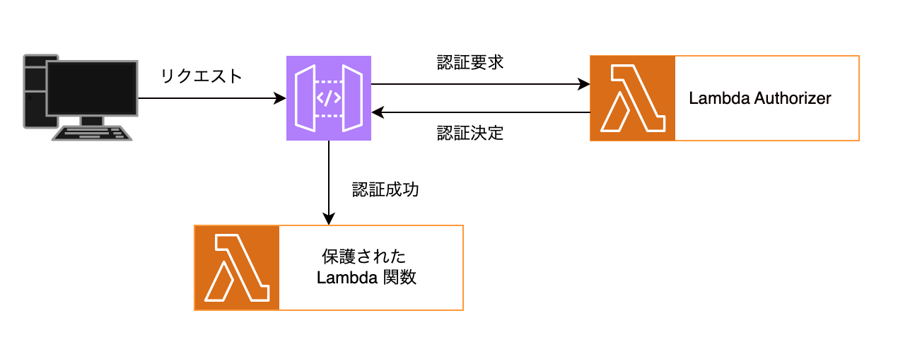

# API Gateway HTTP API with Lambda Authorizer

<p align="center">
  
</p>


# 概要
このプロジェクトはAWS API Gateway HTTP APIとLambda Authorizerを使用した認証システムの実装です。Terraformを使用してインフラをコード化し、Lambdaの実装にはPythonを使用しています。このシステムにより、認証されたユーザーのみが保護されたAPIエンドポイントにアクセスできます。

# 機能
+ Bearer トークンによる認証
+ 環境変数を利用した認証シークレットの管理
+ 詳細なログ記録と例外処理
+ CORSサポート
+ JSONレスポンスの日本語対応

## 起動とデプロイ方法

以下のコードを実行してインフラを構築します。
```
bin/terraform_apply
```

## 使用方法
認証トークン（AUTH_SECRET）を使用してAPIにアクセスします。
```
# cURLを使用する場合
curl -H "Authorization: Bearer YOUR_AUTH_SECRET" https://your-api-id.execute-api.your-region.amazonaws.com/protected
```

### 認証トークンの確認方法
デプロイ後、認証トークン（AUTH_SECRET）は以下の方法で確認できます：

AWSコンソールから
1. AWSマネジメントコンソールにログイン
2. Lambda関数「api_gateway_authorizer」を開く
3. 「設定」タブ→「環境変数」で確認

### レスポンス例
正常なレスポンス:
```
{
  "message": "認証成功！保護されたリソースにアクセスできました",
  "principalId": "user",
  "timestamp": "2025-04-05 12:34:56",
  "region": "ap-northeast-1",
  "authContext": {
    "stringKey": "string value",
    "numberKey": 123,
    "booleanKey": true
  }
}
```

### 停止
以下のコードを実行すると停止できます。
```
bin/terraform_destroy
```
